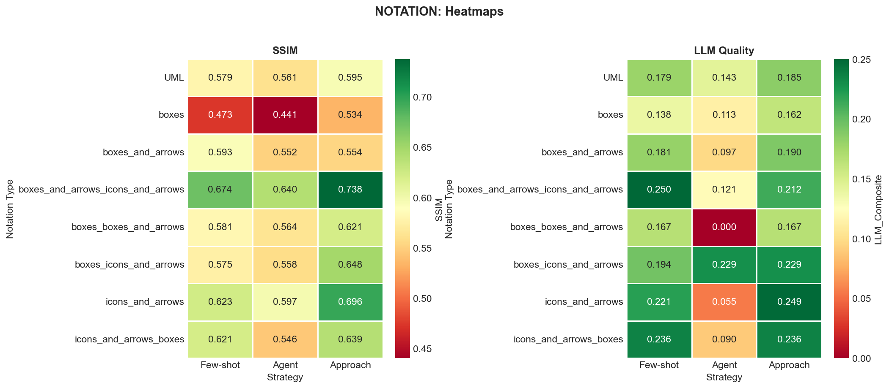

the above figure presents the results for the image similarity metrics which are not presented in the paper.
this below image presents the comlete picture of the notation images. SSIM for the notation is not present in the paper which is presented belo in fof the heatmap for better comparision.

the below is the figure which provides the observations from the analysis of the results of the different approaches with mapping concerns to the quality attributes.
